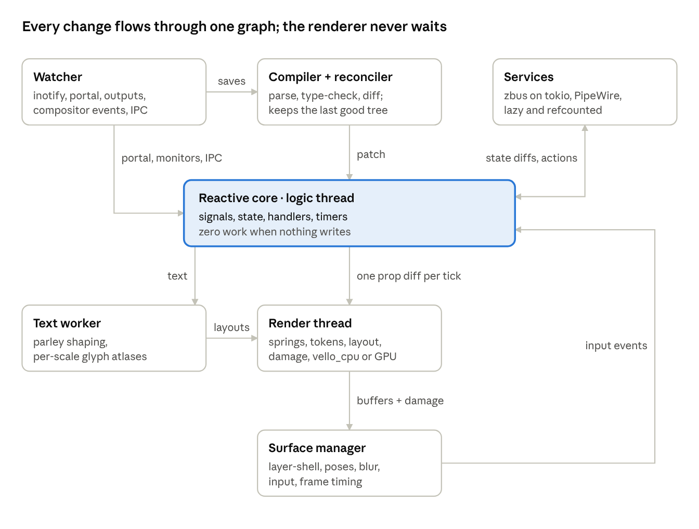
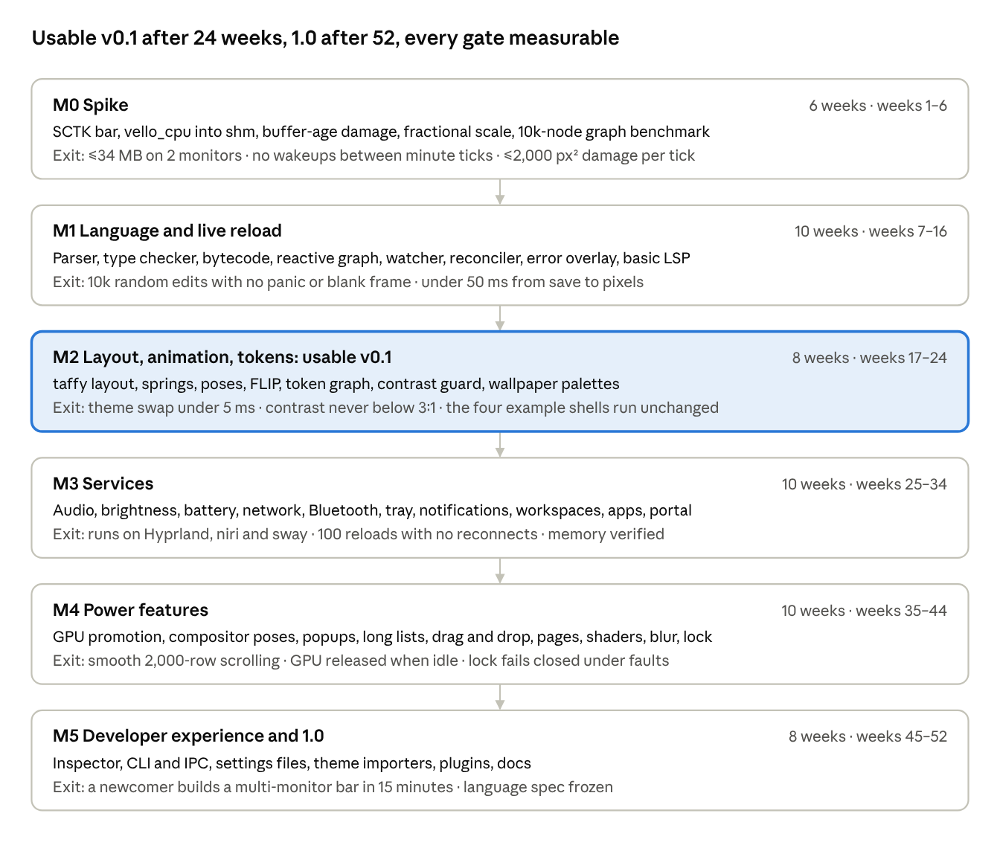

# Shell Toolkit Design: A First-Principles API

Oct 4, 2026 · @Jacob

## Summary

Build **Strand** (working name): a Rust shell toolkit where you write bars, launchers, OSDs and notification stacks in one small typed declarative language. Everything animates by default, nothing runs when nothing changes, and saving any file is a state change, not a restart.

This design came from 10 research agents, 3 competing API proposals, 4 lens critics, a synthesis, 2 adversarial reviews, a dedicated hot-reload pass and a fresh-eyes ergonomics review.

**Mental model.** A shell is a tree of nodes. Every property is a live expression over state, services and tokens. Every change, including a file save, a theme switch or a plugged-in monitor, flows through one reactive graph and reaches the screen through springs.

**Headline decisions**

1. **One language, no seam.** No markup-plus-script split, no string-keyed bridge. Bindings compile to bytecode that Rust evaluates; handlers are cancellable coroutines.
2. **Defaults remove ceremony.** A `bar` appears on every monitor, every visual prop is a spring, service items carry their own keys, files auto-load. There are no imports and no entry file.
3. **Few concepts, learned in layers.** One conditional-style form (`when`), source order wins like CSS, one loop form (`for`), one two-way binding (`<->`). A hello bar uses 6 concepts.
4. **Design tokens are runtime signals.** `$accent`, `$space.2` and friends live in the graph. A theme swap springs the palette in OKLab; nothing rebuilds.
5. **Hot reload is a reconcile, with real-time change detection.** Config directories, symlink targets, wallpapers, TOML settings, portal dark-mode and monitor hotplug all flow in live. State is kept by identity; a broken save keeps the last good tree.
6. **CPU-first rendering with exact damage.** vello\_cpu draws into shared memory, a clock tick repaints about 60×20 px, and the GPU starts only for heavy animation. Target: about 30 MB for a two-monitor bar.
7. **Blur is declared, never captured.** The compositor blurs through `ext-background-effect-v1` where supported, with a clear fallback ladder.

**The whole hello bar**

```
bar Top {
  edge: top; height: 32
  split {
    start  { text windows.focused?.title ?? "" }
    center { text clock.format("%H:%M") }
    end    { text pct(battery.percent) }
  }
}
```

That file is already on every monitor, reactive, themed and animated. It wakes once a minute.

## Lessons from prior art

Prior toolkits break at seams: between two languages, between window and scene graph, and between config file and running process. Strand removes each seam by construction.

| Project | Copy | Avoid |
| --- | --- | --- |
| [pleamar](https://github.com/k4ditano/pleamar) | A spring on every prop; render thread never waits on logic; true idle; no-code services; did-you-mean errors; last good scene on a broken save | Luau seam keyed by strings; `max N` capacities; colours fixed at compile time; silent redeclare; VM-restart reload; 250 ms polling; full-surface repaint; screen-capture blur |
| [Quickshell](https://github.com/quickshell-mirror/quickshell) | Bindings plus real layout; per-monitor `Variants`; `IpcHandler`; window reuse on reload | `modelData` ceremony; opt-in `Behavior on` animation; a GL context per popup; real configs at 0.5–1.26 GB |
| [AGS / Astal](https://github.com/Aylur/ags), [eww](https://github.com/elkowar/eww), Ignis | Fine-grained accessors; keyed `<For>`; `:run-while` polling only when visible | No reload, or a full reset and re-exec; shell scripts as the data layer |
| [ironbar](https://github.com/JakeStanger/ironbar), [ashell](https://github.com/MalpenZibo/ashell) | Per-field reload policy; keep the old config on error; directory inotify | File-only watches; a typo resets everything to defaults |
| Slint, React, Flutter | One front end for runtime and LSP; identity plus signature; derived values recompute on reload | Assignment silently kills bindings; new defaults ignored on reload; identity by position |
| SwiftUI, Material 3, W3C design tokens | Inherited environment values; runtime tokens; reference → system → component token tiers; separate springs for movement and effects | Order-sensitive modifier chains; tokens resolved at build time |

The heavy ones are heavy because a full runtime sits under every surface. The fragile ones reload by restarting, which forgets state and ignores new defaults. The verbose ones make you wire the same value twice: a property plus an `onChange`, or a fact plus a string key.

## Good vs bad vs ugly

The test for every API choice: does it remove a concept, or add one? Good design deletes wiring. Bad design adds friction you can learn around. Ugly design fails silently, and that is what makes shells feel fragile.

### Good: keep and build on

| Pattern | Elsewhere | Strand |
| --- | --- | --- |
| Defaults do the obvious thing | `Variants { model: Quickshell.screens; PanelWindow { required property var modelData …` | `bar Top { edge: top }` is on every monitor |
| Animation on by default | `Behavior on color { ColorAnimation { duration: 150 } }` | `bg: $accent` already springs |
| Services are typed live values | `Process { command: ["date"] }` plus a `Timer` | `clock.format("%H:%M")`, which wakes once a minute |
| One two-way binding | `value={v} onChange={…}`, then `open: x; on dismiss { x = false }` | `value: <-> audio.sink.volume`, `open: <-> open` |
| Time as vocabulary | `clearTimeout` / `setTimeout` bookkeeping | `after 6s while !hover { n.expire() }` |
| Inherited style plus tokens | `font.family` on every `Text` | `col { font: $font.ui; color: $fg … }` covers all children |
| Errors at load | `undefined` at runtime | `critcal` → "did you mean `critical`?" with file, line and caret |

### Bad: friction to design out

| Pattern | Problem | Fix adopted |
| --- | --- | --- |
| Several syntaxes for one idea | `:hover {}`, `when hover {}` and `self.hover` all mean the same | Only `when hover {}`; `hover` is a plain boolean of the enclosing node |
| Precedence tables | An 8-level variant ranking that nobody remembers | Source order wins, as in CSS |
| Mixed naming | `max-width` beside `time_left`, and `-` is also minus | snake\_case everywhere, matching Rust and service schemas |
| Mini-languages inside strings | `"{x, pct}{? · {y, dur}}"` | Plain functions that pass null through: `join(" · ", pct(x), dur(y))` |
| Whitespace changes meaning | `a -1` vs `a - 1` inside `margin: a b` shorthand | Commas in shorthands: `margin: 8, 8, 0` |
| Two loop forms | `for x in xs` and `list xs { item x }` | Only `for`; virtualisation is a container prop: `list { for h in hits {…} }` |
| Absolute positioning first | `at: 10 + desks.width + 14`; hit boxes restate sizes | Flex layout first; the hit area is the node's own shape |

### Ugly: never ship

| Pattern | Seen in | Why it is ugly |
| --- | --- | --- |
| String-keyed bridge between languages | `fact["ws." .. i .. ".there"]`, `on("press:hti")` | A typo never fires and never errors |
| Fixed capacities | `model mon max 4`, `repeat i in 1..10` (really 1–9) | The fifth monitor silently gets nothing |
| Tokens fixed at compile time | Colour `let`s resolved on load | Theme swap means a reload; derived tokens go stale |
| Restart as reload | Fresh script VM on every save | State lost; one-off events never replayed |
| Silent override | A later file redeclares `accent` without a word | A misspelt override creates a new name instead |
| Assignment that kills a binding | QML `width = 30` inside a handler | Breaks reactivity with no warning; Strand makes it a compile error |
| A runtime under every surface | A GL context per popup; a VM on the render path | Hundreds of MB and dropped frames |

Every "ugly" row is removed by construction: one typed language, dynamic keyed lists, runtime tokens, reload as reconcile, and loud errors for redeclaration and bound-prop assignment.

## The proposed API

Shells are written in `.strand` files: a QML/KDL-like tree with TypeScript-like expressions. Four real shells fit in 169 lines with no imports, no entry file and no second language.

### Why a custom language, not TSX or Luau

A custom language won all 4 critic lenses; TSX scored 5 out of 10 on each. TSX's problems are semantic, not syntactic:

- Closures either put a JS VM on the render path or force two evaluators.
- Hook identity is positional, so hot reload loses state.
- Destructuring silently drops reactivity.

A markup-plus-Luau split recreates pleamar's string seam. A restricted language is what makes true idle, exact dependency tracking and state-preserving reload possible. The cost is building the LSP ourselves; one compiler crate serves the runtime, `strand check` and the LSP.

### The rules

- **One call shape.** `kind [positional] { props; children }` for elements and components alike: `Dot ws`, `Toast n { dense: true }`. Declare with `component Toast(n: Notification, dense: bool = false)`; children render at `slot`.
- **Props.** `name: expr`, ended by `;` or a newline. snake\_case everywhere. Shorthands take commas: `margin: 8, 8, 0`.
- **Conditional style.** `when cond { props }`. `hover`, `pressed`, `focused`, `selected` are booleans of the enclosing node. Another node's: give it `id:` and read `vol.hover`. Later `when` wins.
- **Structure.** `if`/`else`, `match`, `for x in xs [key e]`. Service items and keyed collections bring their own keys; plain data without a key is a compile error.
- **Poses.** `enter {}` is where a node animates in from; `exit {}` mirrors it unless given.
- **State.** `state x = 0`; add `persist` to keep it across restarts. `state prefs from "prefs.toml" { … }` is a typed, two-way settings file. `let` is derived and read-only. `export` makes a value reachable as `file.name` from the CLI.
- **Events and time.** `on click`, `on scroll(dy)`, `on show`. `on change x` fires on changes, never at boot or reload; `on change x after 1.2s` debounces. `after T while cond` and `every T while cond` are timers that pause when the condition is false.
- **Two-way.** `prop: <-> target` binds a widget to `state`, a writable service field or a settings field.
- **Errors, not surprises.** Assigning to a bound prop, redeclaring a name across files and an unknown name are all load errors with a fix.

### Learning ladder

Nothing at level N+1 appears in a level-N example.

| Level | You learn | You can build |
| --- | --- | --- |
| 1 | Surfaces, nodes, props, services as live values | The hello bar in the summary |
| 2 | `$tokens`, `component`, `for`, `when`, `on click` | Workspace dots, tray |
| 3 | `state`, `<->`, `if`, `popup`, `enter` | Clock with calendar, volume slider |
| 4 | `on change … after`, `after … while`, `persist`, `export`, `list` | OSD, notifications, launcher |
| 5 | `tokens`, spring overrides `~`, `service from dbus`, `Async`, `pages`, drag and drop, shaders | Control centre, dock, custom services |

### (a) Bar on every monitor, with calendar popup: 83 lines

pleamar's bar takes 194 lines (131 without comments) across two languages, and has no calendar, battery or tray.

```
// bar.strand: one instance per monitor; `screen` is in scope
bar Top {
  edge: top; height: 36; margin: $space.2, $space.2, 0
  bg: $surface.alpha(0.72); blur: 24; radius: $radius.lg; shadow: $elevation.md
  font: $font.ui; color: $fg                      // inherited by every child
  split { pad: 0, $space.3                         // centre is truly centred
    start { gap: $space.3
      row { gap: $space.1
        for ws in workspaces.on(screen) { Dot ws } // keyed by ws.id, no max
      }
      text windows.focused?.title ?? "" { color: $fg.muted; max_width: 40%; ellipsis: end }
    }
    center { Clock }
    end { gap: $space.3
      Volume
      if battery.present { Battery }
      for item in tray.items {
        image item.icon { size: 16
          on click     { item.activate() }
          on secondary { item.menu.open() }
        }
      }
    }
  }
}

component Dot(ws: Workspace) {
  box { size: 8; radius: full; bg: $fg.alpha(0.25); hit: grow(6)
    when ws.occupied { bg: $fg.muted }
    when ws.focused  { width: 24; bg: $accent }    // later `when` wins, like CSS
    when ws.urgent   { bg: $error }
    when hover       { bg: $accent.hover }
    when pressed     { scale: 0.9 }
    enter { width: 0; opacity: 0 }                 // exit mirrors enter
    on click { ws.focus() }
  }
}

component Volume {
  row { gap: $space.1
    on scroll(dy) { audio.sink.volume -= dy * 0.05 }
    icon audio.sink.icon { on click { audio.sink.muted = !audio.sink.muted } }
    if hover {                                     // the row's hover, latched while dragging
      slider { width: 90; value: <-> audio.sink.volume
               enter { width: 0; opacity: 0 } }
    }
  }
}

component Battery {
  row { gap: $space.1
    icon battery.icon
    text join(" · ", pct(battery.percent), dur(battery.time_left))
    when battery.percent < 0.15 && !battery.charging { color: $error }
  }
}

component Clock {
  state open = false                               // one per monitor
  text clock.format("%a %d  %H:%M") {              // wakes once a minute
    on click { open = !open }
    popup { open: <-> open; Calendar }             // anchored here; Esc or click-away closes
  }
}

component Calendar {
  state month = clock.today.month_start()
  col { pad: $space.3; gap: $space.2; bg: $surface; radius: $radius.lg; shadow: $elevation.lg
    row { align: center
      button "‹" { on click { month = month.add(months: -1) } }
      text month.format("%B %Y") { grow: 1; align: center }
      button "›" { on click { month = month.add(months: 1) } }
    }
    grid { columns: 7; gap: $space.1
      for d in calendar.days(month) {
        text d.date.format("%e") { width: 28; height: 28; align: center
          when !d.in_month { color: $fg.faint }
          when d.date == clock.today { bg: $accent; color: $on_accent; radius: full }
        }
      }
    }
  }
}
```

### (b) Fuzzy app launcher: 30 lines

```
// launcher.strand. Bind a key to: strand toggle launcher.open
export state open = false
state query = ""
let hits = apps.search(query)          // Async<[Hit]>: fuzzy + frecency, keeps last result

panel Launcher {
  screens: focused; layer: overlay; anchor: center; keyboard: exclusive
  open: <-> open                       // Escape, click-away and focus loss write false
  enter { opacity: 0; scale: 0.96 }    // animated by the compositor, no repaint
  on show { query = "" }
  col { width: 600; pad: $space.3; gap: $space.2; radius: $radius.xl; clip: true
        bg: $surface.alpha(0.82); blur: 32; shadow: $elevation.xl
    input { text: <-> query; placeholder: "Search apps"; font: $font.title; focus: true; nav: results }
    list { id: results; max_height: 420               // virtualised; arrows move selection
      for h in hits {
        row { pad: $space.2; gap: $space.3; radius: $radius.md; align: center
          when hover    { bg: $surface.hi }
          when selected { bg: $accent.container }
          on activate { h.app.launch(); open = false }
          image h.app.icon { size: 32 }
          col { grow: 1
            text h.app.name { marks: h.ranges; mark_color: $accent; weight: 600 }
            text h.app.comment ?? "" { font: $font.caption; color: $fg.muted; ellipsis: end }
          }
        }
      }
    }
    if hits.len == 0 && query != "" && !hits.pending { text "No matches" { color: $fg.muted } }
  }
}
```

### (c) Notification stack: 37 lines

```
// toasts.strand
export state dnd = false persist
let shown = notifications.popups.filter(n => !dnd || n.urgency == critical).take(5)

panel Toasts {
  screens: focused; layer: overlay; anchor: top_right; margin: $space.3; keyboard: none
  open: shown.len > 0
  col { width: 380; gap: $space.2
    for n in shown { Toast n }                    // keyed by n.id automatically
  }
}

component Toast(n: Notification) {
  col { pad: $space.3; gap: $space.2; radius: $radius.lg; border: 1, $border
        bg: $surface.alpha(0.88); blur: 24; shadow: $elevation.lg
    enter { x: 420; opacity: 0 }
    exit  { x: 420; opacity: 0; height: 0 }       // siblings slide up to fill the gap
    when hover { bg: $surface.hi }
    when n.urgency == critical { border: 1, $error }
    after n.timeout ?? 6s while !hover && n.urgency != critical { n.expire() }
    on click     { n.activate() }
    on secondary { n.dismiss() }
    row { gap: $space.2
      image n.image ?? n.app.icon { size: 36; radius: $radius.sm }
      col { grow: 1
        text join(" · ", n.app.name, n.summary) { weight: 600; ellipsis: end }
        text n.body { markup: basic; max_lines: 4; color: $fg.muted }
      }
      icon "window-close-symbolic" { size: 14; on click { n.dismiss() } }
    }
    if n.actions.len > 0 {
      row { gap: $space.1
        for a in n.actions { button a.label { grow: 1; on click { a.invoke() } } }
      }
    }
  }
}
```

### (d) Volume and brightness OSD: 19 lines

```
// osd.strand. Media keys stay in the compositor: strand set audio.sink.volume +5%
enum Kind { volume, brightness }
state kind = volume
state shown = false
on change audio.sink.volume, audio.sink.muted { kind = volume; shown = true }
on change brightness.level                    { kind = brightness; shown = true }
on change audio.sink.volume, audio.sink.muted, brightness.level after 1.2s { shown = false }
let level = kind == volume ? (audio.sink.muted ? 0 : audio.sink.volume) : brightness.level

osd Level {                                       // focused monitor, overlay, click-through
  anchor: bottom; margin: 0, 0, 96; open: shown
  enter { opacity: 0; scale: 0.9 }
  row { width: 260; pad: $space.3; gap: $space.3; align: center
        radius: full; bg: $surface.alpha(0.8); blur: 24; shadow: $elevation.lg
    icon kind == volume ? audio.sink.icon : "display-brightness-symbolic" { size: 20 }
    meter level { grow: 1; height: 6; color: $accent; track: $fg.alpha(0.15) }
    text pct(level) { width: 4ch; align: end; font: $font.mono }
  }
}
```

Because `on change` never fires at boot, on a sink switch or on reload, the OSD never pops up when you log in or save a file.

### Escape hatches for complex work

- **Shaders:** `shader "aurora.wgsl" { u_speed: 0.4; u_tint: $accent }`, checked with naga, hot-reloaded.
- **Canvas:** `canvas { draw: (c) => … }` for charts and visualisers, with the same paint API the renderer uses.
- **Custom services:** `service ppd from dbus system "net.hadess.PowerProfiles" { profile: text rw = ActiveProfile }`, checked against introspection. Or a Rust crate with `#[service]`.
- **IPC and CLI:** `strand get | set | toggle | watch | call` over a socket and D-Bus.

## Reactivity and state model

A fine-grained push-pull signal graph (the Leptos/Solid model, glitch-free) runs on a logic thread. When nothing writes, nothing is dirty and no frame callbacks are requested: true idle.

- **Graph.** Clean/check/dirty colouring with equality cut-off, so a change that produces the same value stops there. Nodes are generational ids in a `slotmap`; a stale read returns an error value, never a panic.
- **Three kinds of value.** `state` is writable. `let` and props are lazy derived values. Service fields are writable only where the service marks them `rw`. Assigning to a `let` or a bound prop is a compile error.
- **Keyed collections, no capacities.** `type Pin { app: AppId; label: text }` with `state pins: [Pin] key app = []`. Handlers use `push`, `insert`, `remove_key`, `move`, `update`. Services publish diffs (`VecDiff`), and `.filter`, `.map`, `.take`, `.sort_by` update incrementally and keep keys.
- **Async without ceremony.** `apps.search(q)` and `material(image:)` return `Async<T>`: it keeps its previous value, and exposes `.pending` and `.error`. `x ?? fallback` covers both. Using `Async<T>` where `T` is expected is a type error, so you can't forget the loading state.
- **One tick, one diff.** Writes batch into a single prop diff per tick. The render thread owns all springs and never waits on logic.
- **State vs events.** State is latest-value and coalesced per frame. Events such as `on notifications.received(n)` are lossless queues.
- **Handlers** are coroutines that return errors as values. On unmount they are cancelled at their next `await`. `fn`s are pure.
- **Feedback loops.** A static cycle is a load error that names the path. Writes to a service carry a generation tag, so a service echoing your own pending write back is ignored. More than 30 writes per second to one cell from one handler warns and throttles.
- **Persistence and settings.** `persist` stores the value with a hash of its default, so a changed default can be noticed. Settings files are covered under live reload.
- **Who wins.** `strand set` on a `state` is an ordinary write. For tokens and settings fields the order is runtime overlay > file > default. When a save is shadowed by an overlay, the reload overlay says so: `accent: file changed but runtime overlay wins [clear]`.

## Styling, tokens and theming

Tokens are live values in the reactive graph, not constants. Swapping a theme, a wallpaper or a single token springs the colours in OKLab in under 5 ms of work, with no tree rebuild and no reload.

### Token model: three tiers

| Tier | What it holds | Example |
| --- | --- | --- |
| Palette | A typed schema of colour roles, mapping 1:1 onto Material 3 system roles | `$surface`, `$fg`, `$accent`, `$on_accent`, `$error`, `$outline` |
| Base tokens | Scales and derived roles, written as expressions over the palette | `$space.2`, `$radius.lg`, `$font.ui`, `$motion.spatial`, `$surface.hi: $surface.mix($fg, 8%)` |
| Component tokens | Knobs a component exposes for overriding | `component Toast(n) tokens { radius: $radius.lg }` exposes `$Toast.radius` |

- **Derived tokens stay derived.** `$fg.muted: $fg.alpha(0.65)` re-evaluates when `$fg` changes. This fixes pleamar's stale-copy problem. Derived tokens form a graph; a cycle is a load error. Results are gamut-mapped.
- **Methods are calls.** A `$` path segment followed by `(` is a method (`alpha`, `mix`, `lighten`, `darken`), so adding methods later never breaks token names.
- **Importers** for Material seed or image, base16/base24, Catppuccin, matugen output and W3C design-token JSON must fill the whole palette schema. One table derives any role they lack.
- **Loud overrides.** Redefining a token needs `override`. A misspelt override is an unknown-name error, not a new token. A raw hex colour in a prop is a lint; defaults in settings are exempt.

### Theme file

```
// theme.strand
enum Look { auto, light, dark, wallpaper, mocha }
export state look = auto persist
state prefs from "~/.config/strand/prefs.toml" {
  accent: color = #7aa2f7; wallpaper: path = "~/Pictures/wall.jpg"; compact: bool = false
}
let dark = match look { auto => system.dark, light => false, _ => true }
let scheme: Palette = match look {
  wallpaper => material(image: prefs.wallpaper, variant: tonal_spot, dark: dark)
               ?? material(seed: prefs.accent, dark: dark),   // while quantising, or if missing
  mocha     => import("catppuccin:mocha"),
  _         => material(seed: system.accent ?? prefs.accent, dark: dark, contrast: system.contrast),
}
tokens base {
  space  { 1: 4px; 2: 8px; 3: 12px; 4: 16px }
  radius { sm: 6px; md: 10px; lg: 14px; xl: 20px; full: 999px }
  font   { ui: "Inter" 13px 500; title: "Inter" 18px 600; caption: "Inter" 11px; mono: "JetBrains Mono" 12px }
  motion { spatial: spring(700, 0.9); effects: spring(1600, 1); bouncy: spring(380, 0.75) }
  elevation {
    md: 0 2px 8px $shadow.alpha(0.25)
    lg: 0 8px 24px $shadow.alpha(0.3), 0 1px 2px $shadow.alpha(0.2)
    xl: 0 16px 48px $shadow.alpha(0.4)
  }
  surface.hi:       $surface.mix($fg, 8%)
  fg.muted:         $fg.alpha(0.65)
  fg.faint:         $fg.alpha(0.35)
  accent.hover:     $accent.mix($on_accent, 8%)
  accent.container: $accent.alpha(0.22)
  border:           oklch(from $surface, l: l + 0.12)
}
tokens compact extends base { override space { 1: 2px; 2: 4px; 3: 8px; 4: 12px } }
use tokens prefs.compact ? compact : base, palette scheme
```

A theme switcher anywhere in your shell is one line: `segmented { options: Look; value: <-> theme.look }`. From a terminal or keybind: `strand set theme.look mocha`.

### How a swap animates

Writing `look`, a portal dark-mode change, a new wallpaper, `strand set` and saving `theme.strand` all take the same path.

1. Dependent tokens re-resolve on the logic thread.
2. Only the palette roots spring, in OKLab. Each frame the render thread re-evaluates the small token graph (about 100 operations), so every derived token stays exact mid-animation.
3. **Contrast guard.** Text lightness is solved to keep declared text/background pairs at 3:1 or better throughout. Where a light↔dark swap makes that impossible, the surface snapshots its old frame once and crossfades.
4. **What can't interpolate** snaps: fonts snap, shadow lists are padded to equal length, layout lengths snap while paint offsets spring. `reduced_motion` snaps everything.

### Wallpaper palettes

- `material(image:)` quantises a 128 px downscale off-thread with the [`material-colors`](https://github.com/Aiving/material-colors) crate, cached by content hash.
- Both the wallpaper path and its symlink target are watched, so `swww` or a script replacing the file re-themes live.
- The old palette holds until the new one is ready. The last palette is persisted, so boot never flashes default colours.
- `strand export gtk | kitty | hyprland` writes the same palette for the rest of the desktop.

### Overrides

Inherited props (`font`, `color`) work on any container. To override tokens for a subtree, `set { $surface: $surface.alpha(0.5) }`; on the right-hand side `$surface` means the inherited value, so this is not a cycle. The inspector shows provenance: `bg ← surface.hi ← base ← palette:wallpaper`.

## Layout, animation and input

Flex layout is the default and absolute placement is opt-in; every visual prop springs, and paint-only changes never trigger relayout.

**Layout**

- **Containers** on [taffy](https://github.com/DioxusLabs/taffy) 0.14: `row`, `col`, `stack`, `grid`, `scroll`, `list` (virtualised), `split` (start/centre/end with a truly centred middle), `spacer`. Flex props plus `min_*`/`max_*`. `place: absolute` when you really want coordinates.
- **Container queries.** `when self.width < 300 { … }`, with 4 px hysteresis so it can't flicker, and at most one extra pass per frame.
- **Hit testing** uses the rounded shape. `hit: grow(6)` enlarges it for tiny targets. Shadows enlarge the buffer but not the input region.

**Animation**

- **Springs everywhere.** `$motion.spatial` for movement and size, `$motion.effects` for colour and opacity. Override per prop with `~`: `width: 24 ~ $motion.bouncy`, `~ 200ms`, `~ instant`. Retargeting mid-flight keeps velocity, so interrupted animations never jolt.
- **Paint-only props** (`x`, `y`, `scale`, `rotate`, `opacity`) never relayout.
- **Size springs** relayout only the subtree under the nearest size-stable ancestor, on the render thread beside the springs. Reordering uses FLIP, so list items glide to their new slots.
- **Poses.** `enter`/`exit` apply to surfaces, `if` branches, list items and pages. A removed subtree plays `exit`, then unmounts and stops its service subscriptions.

**Input and structure**

- **Events** go to the innermost handler; `propagate()` passes one on. `keyboard: none | on_demand | exclusive` sets focus. `nav: results` routes arrow keys from an input to a list.
- **Drag and drop.** `drag: pin` on the source; `on drop(p: Pin, at: int) { pins.move(p.app, at) }` on the target. Reordering springs by key. Files, apps and text from other programs arrive as typed `Drop` values.
- **Pages.** `pages current: page { page wifi {…}; page bluetooth {…} }` gives directional transitions. Hidden pages unmount, so a Wi-Fi scan stops when you leave that page.
- **Popups** are anchored xdg\_popups that nest, which is how tray menus work. `tooltip: expr` adds a tooltip.
- **Lock screen** on `ext-session-lock`. Authentication runs in a small forked PAM helper. The lock is exempt from reload and fails closed: if anything faults, a built-in password field appears.

## Motion and visual effects

Every effect ricers commonly reach for is a built-in prop or node, almost all of them run on the CPU within the memory budget, and a minimalist shell pays nothing because nothing runs unless you write it. Eight heavy effects ship as bundled GPU shaders that start only when used.

This catalogue comes from a survey of popular Quickshell shells (end-4, caelestia, DankMaterialShell, noctalia), Hyprland and KWin decorations, pleamar, Material 3 Expressive and Apple's Liquid Glass. Costs are from a vello\_cpu 0.3 microbenchmark: "trivial" is under 0.1 ms per frame for a 300×40 px region, "ok" is under 0.5 ms.

### Shape and geometry

| Primitive | Syntax | Cost |
| --- | --- | --- |
| Per-corner radii, squircle corners | `radius: 14, 14, 0, 0; corners: squircle` | Trivial |
| Concave fillets, so a panel grows out of the bar or screen edge | `attach: top` on a popup or panel | Trivial |
| Shape library with morphing (Material 3 cookie, clover, burst, pill, polygons) | `shape: cookie` → `when loading { shape: burst }`; morphs by spring | Trivial |
| Stroke styles: dash, trim, caps, wavy | `stroke: 3, $accent { trim: 0, progress; wave: 2, 18px; cap: round }` | Trivial |
| Arc and ring gauges | `arc { value: cpu.usage; sweep: 270deg; width: 4 }` | Trivial |
| Goo merge (metaballs): children melt together | `merge 10 { … }` around siblings | Ok, via marching squares |

### Paint and light

| Primitive | Syntax | Cost |
| --- | --- | --- |
| Linear, radial and conic gradients; banding removed by automatic dithering | `bg: linear(45deg, $accent, $tertiary)`, `conic(from: 90deg, …)` | Trivial |
| Gradient borders with animated angle; multiple outlines | `border: 2, conic(from: t * 60deg, $accent, $secondary, $accent)` | Trivial; only the ring repaints |
| Glow on boxes, text and icons | `glow: 12, $accent.alpha(0.6)` | Ok; cached as 9-slice or pixmap |
| Inner shadow and rim light (lit top edge) | `inner_shadow: 0 2px 6px $shadow; rim: top, $fg.alpha(0.15)` | Ok; cached |
| Grain | `grain: 0.04` | Trivial when static |
| Text effects: outline, gradient fill, per-letter animation | `text_stroke: 1, $bg; fill: linear(…)`; `letters { y: 2 * wave(1s, phase: index * 0.1) }` | Trivial–ok |
| Scrim and dim behind popups | `scrim: $shadow.alpha(0.3)` on a popup or panel | Single-pixel buffer, free |

### Filters and compositing

| Primitive | Syntax | Cost |
| --- | --- | --- |
| Colour filters on any subtree or image | `filter: grayscale(1)`, `saturate(1.3)`, `hue(30deg)`, `brightness(0.9)`, `tint($accent)` | Trivial–ok; Strand implements these itself, since vello's versions are unimplemented |
| Blend modes | `blend: screen \| add \| multiply \| overlay \| difference` | Ok |
| Masks: edge fades, radial reveals, shape masks | `mask: fade(bottom, 24)`, `mask: radial(…)`, `mask: shape(cookie)` | Trivial–ok |
| Blur over your own content | `backdrop: blur(16)` inside a surface | Heavy; drawn at quarter scale, promoted to GPU above about 0.2 Mpx |
| Blur behind the surface | `blur: 24` (existing) | Free; the compositor does it |

Tuning the compositor's blur (saturation, noise, vibrancy) belongs to the compositor; `strand compositor-rules` prints matching Hyprland rules.

### Motion and time

| Primitive | Syntax | Cost |
| --- | --- | --- |
| Springs, poses, FLIP | Existing | — |
| Named curves and cubic béziers | `~ ease(out_back, 300ms)`, `~ bezier(0.05, 0.9, 0.1, 1.05)` | — |
| Pose presets | `enter: popin(0.8) \| slide(top) \| slidefade \| fade` | — |
| Time signals | `wave(1.6s)`, `t`, `noise(x)` | Only that node repaints, only while visible |
| Keyframes | `keyframes shake { … }` + `play shake` | — |
| Stagger | `stagger: 30ms` on a container | — |
| Shared-element morph across surfaces, so the bar's media pill becomes the media panel | `morph: "media"` on both nodes | Ok |
| Rolling numbers | `text pct(level) { roll: true }` | Trivial |
| Jelly and squash while dragging (vector content) | `jelly: 0.4` | Trivial |
| Pointer parallax and tilt | `parallax: 6px`; `tilt: 8deg` | Parallax trivial; true 3D tilt is GPU |

### Generative, data-driven and media

| Primitive | Syntax | Cost |
| --- | --- | --- |
| Built-in effects | `effect lightning \| sparks \| shimmer \| ripple \| aurora { … }` with a few named knobs | Trivial–ok on CPU; aurora is GPU |
| Particles | `particles { rate: 20; life: 1.2s; sprite: dot(3); glow: 6 }` | Under 1,000: CPU sprite blits; above: GPU |
| Transition masks | `transition: wipe(left) \| disc \| dissolve \| pixelate` on `if`, `pages` and image swaps | Ok |
| Audio spectrum | `spectrum audio.sink { bars: 48; smooth: 0.6; style: mirror }` (FFT via realfft) | Ok; stops when audio is silent |
| Graphs and sparklines with built-in history | `graph cpu.usage { history: 60s; fill: $accent.alpha(0.2) }` | Trivial; only the new column repaints |
| Wavy media progress that flattens when paused | `meter media.position { wave: media.playing ? 3 : 0 }` | Trivial |
| Animated GIF, APNG, WebP | `image "spin.gif"` | Frames streamed, not cached whole |
| Lottie | `lottie "loader.json" { speed: 1 }` via the velato crate | Varies by file |
| SVG with bindable layers | `svg "icon.svg" { #needle { rotate: level * 270deg } }` | Trivial |
| Blurred album art backdrop | `image media.art { fit: cover; filter: blur(30) }` | Ok; cached |
| Live window thumbnails | `thumbnail w` via ext-image-copy-capture | Ok |

### Bundled GPU effects

These 8 start the GPU only while visible and release it 30 s after: bloom, liquid-glass refraction (dispersion, fresnel rim, pointer specular), particles above 1,000, true 3D perspective, raster wobble, CRT and chromatic aberration, aurora and noise fields, and large full-resolution backdrop blur. Your own `.wgsl` shaders use the same path.

**Left out of v1:** video wallpapers (use mpvpaper or the compositor), Rive, wallpaper subject separation (depth masks) and mesh-warp minimise effects.

### What a rice looks like

```
component Now {
  row { radius: full; corners: squircle; bg: $surface.alpha(0.7); blur: 24
        border: 1.5, conic(from: t * 40deg, $accent, $tertiary, $accent)
        morph: "media"                                  // grows into the media panel
    image media.art { size: 28; shape: cookie; rotate: media.playing ? t * 20deg : 0 }
    spectrum audio.sink { bars: 24; width: 72; color: $accent; style: mirror }
    when media.playing { glow: 10 * wave(2s), $accent.alpha(0.4) }
  }
}
```

Nine lines give a squircle pill with a slowly rotating gradient border, a spinning cookie-shaped album cover, a live spectrum and a breathing glow. Only the pill's own pixels repaint, and only while music plays.

### Runtime changes these need

1. **Effect layers in the scene IR.** A tagged group (filter, blend, mask, colour matrix, shader) whose dirty area grows by the effect's reach. Each backend lowers it its own way, so the GPU path is never asked for masks it can't do.
2. **Cached offscreen groups.** Text glows, filtered subtrees and glass sources render once and redraw only when children change; about 4 MB, freed when idle.
3. **CPU raster nodes** for particle sprites, goo fields, grain and dithering, avoiding the per-path overhead that dominates large particle counts.
4. **Per-node clocks with frame caps.** GIFs at their own rate, grain at 12 fps, shimmer at 30, everything else at refresh. The frame loop stops when every clock is idle.
5. **Rectangle clips for damage** (`push_clip_rect`), which cut a 600×500 blur from 8.2 ms to 0.31 ms under a clock-sized damage rect.
6. **Single-threaded vello\_cpu**, because its filters panic when rendering multi-threaded.
7. **`reduced_motion`** turns off loops, time signals and effects; springs snap.

## Rendering, performance and memory budget

Render on the CPU into shared memory with exact damage by default, and promote to the GPU only for heavy animation. A two-monitor bar targets about 30 MB, a clock tick repaints about 60×20 px, and an idle shell does zero work.



File saves and system changes enter at the top and become writes into the reactive core. The render thread receives one diff per tick and owns every spring, so a slow handler never drops a frame.

**Stack**

- **Wayland:** [smithay-client-toolkit](https://github.com/Smithay/client-toolkit) 0.21 plus `wayland-protocols` 0.32 for fractional scale, viewporter, single-pixel buffers, alpha modifier and background effect.
- **Text:** parley 0.11 shapes on a worker thread; swash rasterises into LRU glyph atlases, one per output scale. Mixed-DPI setups stay sharp, unlike pleamar's single max-scale atlas.
- **Paint:** our own scene IR feeds two backends. [vello\_cpu](https://github.com/linebender/vello) into `wl_shm` is the default. vello\_gpu on wgpu 30 handles shaders and surfaces animating large areas for more than 500 ms; the device is dropped after 30 s idle. Backends switch only when springs settle.
- **Images** decode at drawn size into a 6 MB LRU. mimalloc as allocator. GPU crates stay cold unless used; LSP and tree-sitter live in a separate `strand-dev` binary.

**Compositor-animated poses.** Surface-level fades and scales cost no repaint: opacity via `wp_alpha_modifier_v1`, scale via viewporter, small moves via layer-shell margins. Without those protocols, Strand repaints instead.

**Damage and pacing**

- Up to 8 dirty rectangles per frame, a 2–3 buffer shm pool with buffer age, `damage_buffer` and `set_opaque_region`.
- GPU frames send full damage until wgpu's [`present_with_damage` PR #10152](https://github.com/gfx-rs/wgpu/pull/10152) lands. That's acceptable because only large animations run on the GPU.
- Frame callbacks are requested only while something is dirty or a spring is unsettled. Timing comes from `wp_presentation` feedback, so frames lock to the real refresh rate, not a free-running clock.

**Memory budget** (PSS in MB, design estimates to be measured in M0 and M3)

| Item | Bar only, 2×1440p | Full shell, launcher open |
| --- | --- | --- |
| Code and libraries touched, GPU cold | 10–14 | 12–16 |
| Fonts, text caches, atlases | 7 | 9 |
| Bar shm buffers, 3 per monitor | 3.2 | 3.2 |
| Launcher buffers at 2×, freed on close | — | 14 |
| Logic, scene IR, services | 7 | 11 |
| Images, notification history | 1 | 8 |
| Allocator overhead | 1–2 | 2–3 |
| **Total** | **29–34** | **59–64** |
| GPU device if promoted | — | +20–40, dropped when idle |

For comparison, real Quickshell configs reach 0.5–1.26 GB, driven by a GL context per popup and full-resolution image decodes. Scrims and lock backgrounds use single-pixel buffers; a 4K triple buffer would cost about 99 MB.

**Blur ladder.** You write `blur: 24` and optionally `blur_fallback: tint | none`.

1. **`ext-background-effect-v1`**, merged into wayland-protocols staging in May 2025 and derived from KDE's blur. The region follows the rounded shape and is re-sent only when the shape changes.
2. **Hyprland layer rules.** Each surface gets a stable `strand-<Name>` namespace, and `strand compositor-rules` prints the rules to paste.
3. **Tint**, the default fallback: alpha rises by 0.15 so text stays readable, and the inspector says why.

Blur over your own content inside a surface is rendered by Strand at quarter scale, because vello\_cpu 0.3 filters are experimental and cannot blur what lies behind a layer. Strand never captures the screen.

## Live reload and real-time config changes

Saving any file is a state change, not a restart. Design targets at p95: a token edit shows within 35 ms of save, a markup edit within 50 ms, and portal or monitor changes on the next frame.

### Change sources

Every source ends up as a write into the same reactive graph.

| Source | How it's detected | What it becomes |
| --- | --- | --- |
| `.strand`, `.wgsl` files | inotify on config directories, depth 3 | Reload pipeline |
| Symlinked files | The link's directory plus the target's directory | Reload; a link swap counts as an edit |
| Settings TOML, wallpaper | Same watcher | Per-field writes; palette re-quantised |
| Colour scheme, accent, contrast | Portal `SettingChanged(namespace, key, value)`; `ReadOne` at boot | `system.dark`, `system.accent`, `system.contrast` |
| Monitors | `wl_registry` global add/remove; `wl_output` v4 `done`; layer-surface `closed` | `screens` |
| Compositor reload | Hyprland socket2 `configreloaded`; niri `ConfigLoaded { failed }` | `wm.config_reloaded` |
| Apps, icons, fonts | `applications/`, `index.theme`, fontconfig dirs | Cache invalidation |
| CLI and IPC | Unix socket and D-Bus | State writes and overlays |

### Watch directories, not files

inotify watches inodes. Many editors save by writing a new file and renaming it over the old one, so a file watch follows the old inode and goes silent.

- **Vim**'s default `backupcopy=auto` renames the original then writes anew; its help warns this breaks inotify watchers.
- **Helix**'s `atomic-save` is on by default and its docs say it "may confuse" file watchers.
- **VS Code** truncates and rewrites user files in place, so a `MODIFY` event can see a half-written file.
- **JetBrains** safe-write creates sibling backup and temp files.

So Strand watches directories and acts only on `CLOSE_WRITE` and `MOVED_TO`, never `MODIFY`. Editor scratch names (`4913`, `*.swp`, `*~`, `*___jb_*___`) are filtered. A queue overflow triggers a full rescan.

**Symlinked dotfiles.** GNU stow can make `~/.config/strand` itself a link into `~/dotfiles`, so Strand canonicalises each loaded file and also watches the target's directory. home-manager links into the read-only `/nix/store`; `home-manager switch` swaps the link, which the link-directory watch sees. NFS emits no events and falls back to polling with content comparison.

Crates: [`notify`](https://docs.rs/notify/latest/notify/) 8.2 and [`notify-debouncer-full`](https://docs.rs/notify-debouncer-full/latest/notify_debouncer_full/) 0.7, which stitches renames together and drops duplicates. `notify` 9 is still a release candidate.

### The pipeline

1. **Coalesce.** Wait 15 ms after the last completed write, so "save all" is one batch.
2. **Skip no-ops.** Hash each file with BLAKE3. Unchanged content stops here, including Strand's own writes, whose hashes are pre-registered.
3. **Compile off-thread.** A worker parses, type-checks and lowers only changed modules and their dependents. Rendering continues.
4. **Commit atomically.** Commit the largest changed set that type-checks with everything that references it, and hold back the rest. One tick, no blank frame, no teardown.
5. **Keep the last good tree.** On error, the live shell stays. Compiled output is cached by source hash, compiler version and schema hash, so even a broken config still boots from its last good version.

### What each edit does

| Edit | What happens | State kept? |
| --- | --- | --- |
| Token value | Token table swapped; colours spring | Yes |
| Prop or binding | Patched in place; animates from its current value | Yes |
| Node added or removed | `enter` / `exit` play; siblings glide | Yes, elsewhere |
| `state` default | Adopted only if the value was never changed | Yes, if you changed it |
| `state` name or type | That one cell resets, with a warning | No, that cell only |
| Handler code | Restarted; an in-flight `await` is cancelled and reported | Yes |
| Timer duration | Remaining time rescaled | Yes |
| Surface layer, namespace or kind | Only that surface is recreated | Yes |
| Custom service declaration | Only that service restarts; built-ins never do | Yes |
| Anything inside `lock` | Deferred until unlock | Yes |

### Identity and state, in plain words

- A node keeps its identity while its source text maps to it, so editing a node's own props never resets it. Next, `key` or `id` decides, then position among siblings of the same kind. Real ambiguity resets with a warning; Strand never guesses.
- State lives on components, surfaces and list items, never on leaf elements, so the node you're editing can't take your popup state with it.
- A state cell takes a new default only if it still holds the old one. Otherwise the overlay says `launcher.query: kept "fir" (default changed) [reset]`.
- Monitors match on make, model and description, and their state survives a 30-second unplug.
- Escape hatches: `@reset` on a declaration, "reset subtree" in the inspector, `strand reload --hard`.

### Settings files

`state prefs from "prefs.toml" { accent: color = #7aa2f7; compact: bool = false }` declares typed, two-way settings that non-programmers can edit.

- Each field is checked on its own. A bad value keeps that field's last good value with a diagnostic; other fields still apply.
- A TOML syntax error keeps every last good value. A deleted key springs back to its default.
- UI writes and `strand set prefs.compact true` go through `toml_edit`, which keeps comments, spacing and order.
- Writes follow symlinks and replace via temp file plus rename. Read-only targets such as `/nix/store` go to an overlay in `$XDG_STATE_HOME`, with a notice.

### Errors

- Errors that survive 250 ms of quiet open a dismissible overlay listing every diagnostic, with labels, did-you-mean fixes and click-to-open in `$EDITOR`. Format-on-save and delete-then-create saves never flash it.
- A runtime fault freezes only its own component, outlined in red.

### CLI

- `strand watch [--json]` streams reload events: files, edit class, kept and reset cells, timing and diagnostics.
- `strand reload` rescans now; `strand reload --hard` drops non-persisted state and recreates every surface.

### What you see

1. **Tweak `accent` in `theme.strand`.** Helix renames the file into place; Strand sees `MOVED_TO` and takes the token path. Colours glide over 150 ms. The open launcher keeps its query.
2. **Rename a prop `expanded` to `open` in `Calendar`, with the popup open.** An LSP rename saves both files, which commit together. The popup stays open, because its state lives in the parent. Had you saved only `calendar.strand`, it would be held back with `bar.strand:12: unknown prop "expanded"; did you mean "open"?`.
3. **Save a broken file, then fix it.** A missing `}` fails on the worker and the bar keeps ticking. After 250 ms an overlay points at the line. The fix commits and the overlay vanishes.

### Developer experience

- `strand new` scaffolds a working shell. `strand-dev lsp` gives completion after `$`, `.` and `<->`, hovers generated from service schemas, rename, and quick-fixes for "extract component" and missing keys.
- The inspector picks elements across surfaces and shows identity, layout, token provenance, kept-state badges and repaint flashing. It writes edits back only if the file hasn't changed underneath.

### How reload is tested

A CI edit fuzzer generates random edits: tokens, renames, moves, syntax errors and partial multi-file saves.

- Each edit is replayed through five save styles: in place, rename, backup-then-rename, delete-and-create and symlink swap.
- It asserts no panic, blank frame or leaked surface, and state kept exactly as the table says.
- After any sequence, the screen must match a cold boot of the final files, apart from kept state.
- A benchmark fails the build when p95 latency misses its target.

## System services and third-party crates

Services are typed Rust structs that start lazily when a shell first references them, stop 5 s after their last reader leaves, and speak standard protocols first with compositor IPC as a fallback. zbus 5 is the backbone.

**The service contract**

- A service is `#[service(name = "battery")] #[derive(Store)]` with an async `run(cx)` that patches state and emits events, plus typed actions. Its schema drives type checking, LSP hovers and docs.
- **Lifecycle.** The compiler collects which service paths a shell uses. A service starts on first subscription, is reference-counted, and stops 5 s after its last reader leaves or goes invisible. Streams such as a Wi-Fi scan run only while visible.
- **Threads.** Services share one tokio current-thread runtime. PipeWire and the Wayland toplevel protocols each get their own thread, since pipewire-rs is `!Send`.
- **No-code services.** `service ppd from dbus system "net.hadess.PowerProfiles" { profile: text rw = ActiveProfile }` is checked against D-Bus introspection. `from file`, `from listen` and `from poll` sources are checked against the schema you declare. Running commands needs an explicit `permit exec`.
- **Compositor-agnostic first.** Workspaces come from `ext-workspace-v1`, windows from `ext-foreign-toplevel-list`, thumbnails from `ext-image-copy-capture`. Hyprland, niri and sway IPC are adapters for what the standard protocols don't yet cover.

| Crate | Purpose | Notes |
| --- | --- | --- |
| [zbus](https://crates.io/crates/zbus) 5.19, zbus\_xmlgen | D-Bus for UPower, logind, MPRIS, portal, power profiles, notifications | Generate our own typed proxies; `upower_dbus` and `mpris` are stale or libdbus-based |
| tokio 1.53 | Services runtime | zbus, nmrs and system-tray all assume it |
| smithay-client-toolkit 0.21, wayland-protocols 0.32 | Surfaces and protocols | Staging includes ext-workspace, foreign-toplevel-list, image-copy-capture, background-effect |
| pipewire 0.10 | Audio, levels, default sink | No usable WirePlumber binding; read PipeWire's `default` metadata |
| logind-zbus 5.3 | Brightness via `SetBrightness` | No root or udev rules needed |
| nmrs 3.5 | NetworkManager | zbus 5, actively released |
| bluer 0.17, or own zbus proxies | Bluetooth | bluer uses libdbus; a few zbus proxies may be lighter |
| system-tray 0.8.9 | StatusNotifierItem host plus DBusMenu | Used by ironbar |
| Own zbus `#[interface]` | Notification server | notify-rust's server is experimental; fail clearly if dunst or mako owns the name |
| freedesktop-desktop-entry 0.8, freedesktop-icons 0.4 | Launcher data and icons | Watched live |
| nucleo 0.5 | Fuzzy matching with match ranges | Releases stalled since 2024; wrap it, fork if needed |
| swayipc-async 3.0; own Hyprland and niri IPC | Compositor adapters | `hyprland` and `niri-ipc` crates are GPL-3.0; their IPC is simple JSON over a socket |
| notify 8.2, notify-debouncer-full 0.7, blake3 | Live reload | Directory watches; see live reload |
| taffy 0.14, parley 0.11, swash | Layout and text | taffy runs on the render thread |
| vello\_cpu, vello\_gpu 0.3, wgpu 30, naga | Rendering and shaders | Behind our own scene IR |
| material-colors 0.5, palette 0.7, tinted-builder | Palettes and importers | Material spec version pinned |
| toml\_edit, miette, lsp-server, tree-sitter | Settings, diagnostics, LSP | LSP ships in `strand-dev` only |

## Review findings, risks and open questions

The first-principles proposal won 3 of 4 critic lenses, the minimal DSL won the fourth, and TSX won none. The biggest remaining risk is the cost of building a language and its tooling, not the runtime.

**How the three proposals scored** (out of 10)

| Lens | Minimal DSL | TSX with signals | First-principles (chosen) |
| --- | --- | --- | --- |
| Newcomer ergonomics | 7 | 5 | 7.5 |
| Power user, complex GUIs | 6 | 5 | 8 |
| Implementability and performance | 8 | 5 | 7 |
| Theming, tokens and reload | 7 | 5 | 8 |

TSX lost on every lens for the same reasons: a JS runtime's memory and startup cost, positional hook identity on reload, and closures that defeat true idle. The minimal DSL won on performance because it is easier to implement; its disambiguation rules were grafted into the final grammar.

**What the adversarial reviews changed**

- **Reload reset the node you were editing.** Matching used a hash of the node's props, so editing a prop broke the match. Fixed with source-span mapping first, and state only on components.
- **Handlers could keep stale logic.** A handler's hash missed changes to the functions and lets it calls. Fixed with Merkle hashes over everything a handler reaches.
- **Monitors can't be keyed by EDID serial**, which `wl_output` doesn't expose. Fixed by matching on make, model and description.
- **Atomic write-back broke symlinked dotfiles.** Fixed by following symlinks and redirecting read-only Nix targets to an overlay.
- **Launcher open animations would repaint 1.25 Mpx on the CPU every frame.** Fixed by animating surface-level poses in the compositor.
- **Two component call syntaxes, ambiguous lexing, colliding token names, and three different open/dismiss patterns.** Fixed with one call shape, comma shorthands, `$elevation` vs `$shadow`, and `<->`.
- **The ergonomics review cut about a third of the syntax concepts.** It merged `:hover` variants into `when`, the 8-level precedence table into source order, `list … item` into `for`, and string format specs into plain functions.

**Risks**

| Risk | Mitigation |
| --- | --- |
| A custom language means building the LSP, docs and formatter, and LLMs won't know it | One compiler crate for runtime and LSP; completion generated from schemas; LSP in M1; a grammar small enough to fit in one prompt |
| Vello churn (vello\_gpu was renamed from vello\_hybrid in 0.3) | Our own scene IR; a wgpu SDF backend as fallback |
| Blur coverage: sway, labwc and COSMIC have none; Hyprland's support of the new protocol is unverified | The fallback ladder; tint by default |
| Reload semantics and lock-screen security | A written spec, the edit fuzzer, VM-only lock testing, and a small, separately reviewable PAM helper |
| The notification bus name can collide with dunst or mako; nucleo releases have stalled; niri's IPC changes in patch versions | Clear error on name conflict; wrap nucleo; reimplement niri IPC behind a feature flag |
| Memory figures are estimates | Measure in M0 and M3; the exit criteria fail the milestone if over budget |

**Open questions**

- [ ] Should pure helper functions get an optional embedded JS (QuickJS) escape hatch, or stay in-language only?
- [ ] Is a WASM tier for third-party plugins worth it, or are `from dbus` services and Rust crates enough?
- [ ] How deep should AccessKit accessibility go in v1?
- [ ] Do we keep `.strand` as a new language, or use KDL syntax with Strand semantics to borrow its existing tooling?

## Testing

Everything is tested on one developer machine plus free CI, with no extra hardware. CPU-first rendering is what makes this work: almost no test needs a GPU or a real display.

| Tier | Where it runs | What it covers | When |
| --- | --- | --- | --- |
| Unit and property tests | `cargo test`, no display | Parser, type checker, reactive graph, reconciler, state merge, token graph; snapshot tests for diagnostics | Every push |
| Offline render tests | `cargo test`, no display | Scenes drawn by vello\_cpu to PNG and compared with reference images within a colour tolerance; springs sampled at fixed timestamps; theme swaps | Every push |
| Wayland integration | One container: sway headless with software rendering, optionally weston | Layer-shell, popups, damage, input regions; hotplug and mixed DPI faked with `swaymsg create_output` and per-output scales | Every push |
| Services | Same container, private D-Bus via `dbus-run-session` | python-dbusmock for UPower, NetworkManager, BlueZ, logind and notifications; PipeWire with a null sink; small zbus mocks for the portal and tray | Every push |
| Reload fuzzer | Same container, tmpfs | Random edits replayed through five editor save styles; no panic, blank frame or lost state | Every push, longer runs nightly |
| Budgets | Same container | Memory (PSS) and idle wakeups; the build fails above 34 MB for the two-monitor bar | Every push |
| Lock screen | Local QEMU VM | PAM, fail-closed behaviour under injected faults; never tested on your real session | Before touching the lock code, and before releases |
| Daily driving | Your own compositor, nested in a window, then as your real shell | Real-world bugs no lab finds | Always |

**Built-in testability**

- **Injectable frame clock.** Fake presentation timestamps (60 Hz, 144 Hz, jittery) test frame scheduling deterministically, standing in for monitors you don't own.
- **Deterministic springs.** Given a timestamp, a spring's position is exact, so animation frames are testable as images.
- **Machine-readable state.** `strand watch --json` and inspector dumps let tests assert on structure instead of screenshots.
- **`strand report`.** Dumps compositor, protocols, scale factors, memory and frame statistics. Early users with other GPUs, compositors and monitors become the hardware lab.

**Deliberately not tested in-house**

- Real 144 Hz pacing, GPU vendors (Intel, AMD, NVIDIA) and Hyprland or niri specifics. The GPU path is optional and behind a flag; compositor adapters are thin. These rely on `strand report` from opt-in users.

## Roadmap

Six milestones take Strand to a usable v0.1 at week 24 and 1.0 at week 52. Each milestone ends on measurable exit criteria, not a feature list.



Live reload lands early, in M1, so every later milestone is built and tested with it running. M2 is the first point where someone could ship a real themed bar.

## Sources

Pages the research agents opened, as of October 2026. Crate versions come from the crates.io API.

- [pleamar repository](https://github.com/k4ditano/pleamar), cloned and read
- [Quickshell](https://github.com/quickshell-mirror/quickshell), [PR #1049 on startup](https://github.com/quickshell-mirror/quickshell/pull/1049), [DankMaterialShell](https://github.com/AvengeMedia/DankMaterialShell), [caelestia shell](https://github.com/caelestia-dots/shell)
- [AGS](https://github.com/Aylur/ags), [Astal](https://github.com/Aylur/astal), [eww](https://github.com/elkowar/eww), [ironbar](https://github.com/JakeStanger/ironbar), [ashell](https://github.com/MalpenZibo/ashell)
- [Slint reactivity](https://docs.slint.dev/latest/docs/slint/guide/language/concepts/reactivity/), [Slint live preview](https://docs.slint.dev/latest/docs/slint/guide/tooling/live-preview/), [QML property binding](https://doc.qt.io/qt-6/qtqml-syntax-propertybinding.html), [Flutter hot reload](https://docs.flutter.dev/tools/hot-reload), [Dioxus 0.7](https://dioxuslabs.com/blog/release-070/), [reactive\_graph](https://docs.rs/reactive_graph/latest/reactive_graph/)
- [Vello](https://github.com/linebender/vello), [smithay-client-toolkit](https://github.com/Smithay/client-toolkit), [wgpu PR #10152](https://github.com/gfx-rs/wgpu/pull/10152), [ext-background-effect-v1](https://wayland.app/protocols/ext-background-effect-v1), [Hyprland 0.56 release](https://github.com/hyprwm/Hyprland/releases/tag/v0.56.0), [niri window effects](https://niri-wm.github.io/niri/Window-Effects.html)
- [material-colors](https://github.com/Aiving/material-colors), [matugen](https://github.com/InioX/matugen), [palette](https://github.com/Ogeon/palette), [tinted-theming styling](https://github.com/tinted-theming/home/blob/main/styling.md), [CSS relative colors](https://developer.mozilla.org/en-US/docs/Web/CSS/CSS_colors/Relative_colors)
- [notify](https://docs.rs/notify/latest/notify/), [notify-debouncer-full](https://docs.rs/notify-debouncer-full/latest/notify_debouncer_full/), [inotify(7)](https://man7.org/linux/man-pages/man7/inotify.7.html), [Vim options](https://raw.githubusercontent.com/vim/vim/master/runtime/doc/options.txt), [Helix editor config](https://docs.helix-editor.com/master/editor.html), [GNU stow manual](https://www.gnu.org/software/stow/manual/stow.html)
- [Portal Settings interface](https://flatpak.github.io/xdg-desktop-portal/docs/doc-org.freedesktop.portal.Settings.html), [wl\_output](https://wayland.app/protocols/wayland#wl_output), [niri-ipc events](https://docs.rs/niri-ipc/latest/niri_ipc/enum.Event.html), [toml\_edit](https://docs.rs/toml_edit/latest/toml_edit/)

Effects survey and benchmark:

- [end-4 dots-hyprland](https://github.com/end-4/dots-hyprland), [noctalia wallpaper docs](https://docs.noctalia.dev/noctalia/desktop/wallpaper/), [Hyprland decorations summary](https://deepwiki.com/hyprwm/hyprland-wiki/3.10-decorations-and-animations), [hyprglass](https://github.com/hyprnux/hyprglass), [KDE Rounded Corners](https://github.com/matinlotfali/KDE-Rounded-Corners), [better-blur-dx](https://github.com/xarblu/kwin-effects-better-blur-dx), [eww widgets](https://elkowar.github.io/eww/widgets.html), [Waybar issue #2837](https://github.com/Alexays/Waybar/issues/2837)
- [Material 3 Expressive loading indicator](https://9to5google.com/2025/05/16/material-3-expressive-loading-indicator/), [Liquid Glass reference](https://www.conor.fyi/writing/liquid-glass-reference)
- [velato](https://github.com/linebender/velato), [resvg unsupported features](https://github.com/linebender/resvg/blob/main/docs/unsupported.md); vello\_cpu 0.3 costs from a local microbenchmark at vello commit f3000c8
