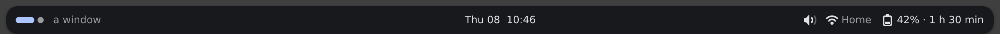
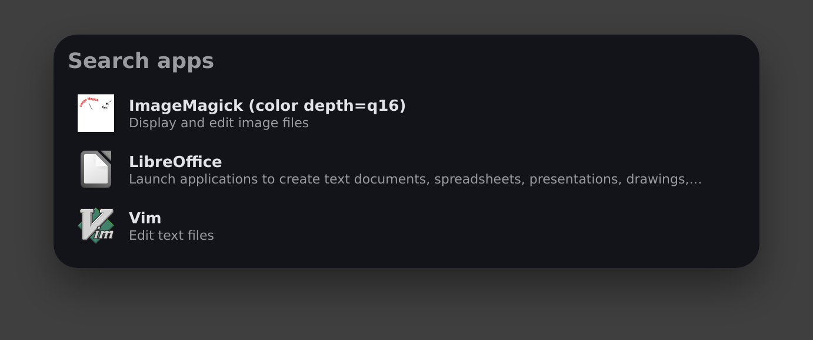
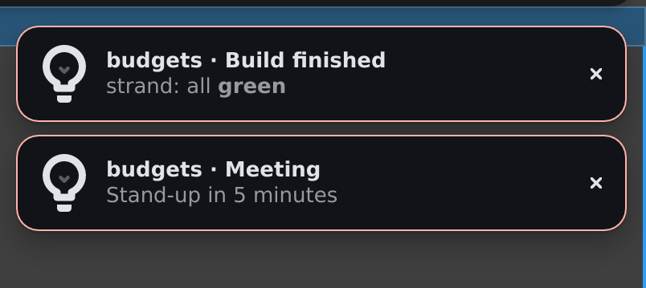
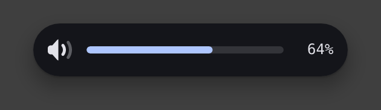
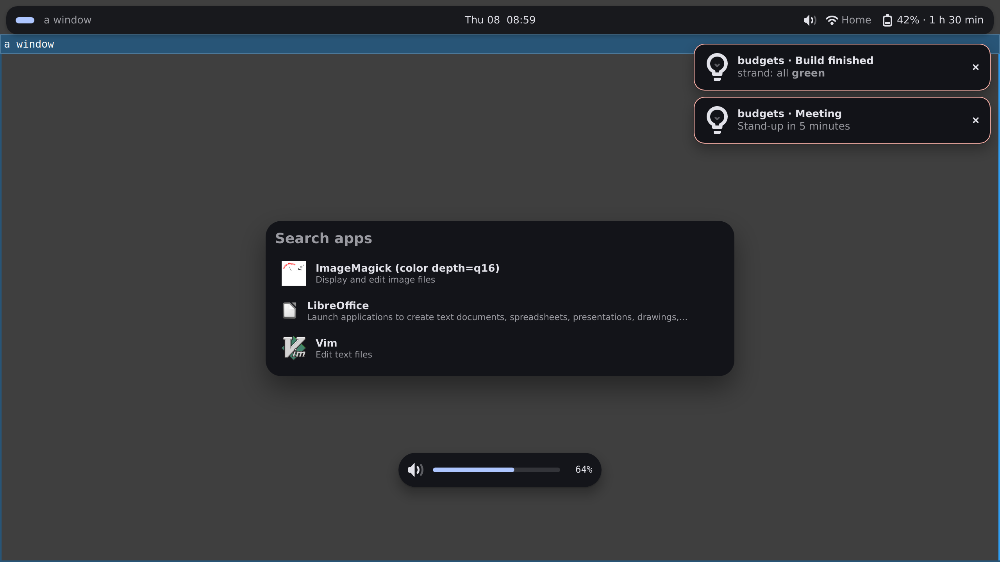

# M3 exit report

Measured 2026-10-08 on the dev container (Intel Xeon @ 2.10 GHz, 4 vCPUs
shared with another agent's builds), Ubuntu 24.04, rustc 1.97.0, headless
sway 1.9 with the pixman renderer, PipeWire 1.0.5 with WirePlumber 0.4.17,
dbus-daemon 1.14.10, python-dbusmock 0.31 (under `/usr/bin/python3.12`,
picked with `STRAND_DBUSMOCK_PYTHON`), release builds with the workspace's
profile (thin LTO, one codegen unit, mimalloc, the per-package size
opt-levels of decisions.md wave4-exitMemory). Every number below comes
from a test in the tree that fails when its gate is missed, run at
`9b4cc13` (wave4/core after merging wave4/exit-ci) and re-checked at
the final heads: review r2 re-ran the design bar, the latency bench and
the screenshots at `f681c45` (bar PSS 31,093 kB, anon 11,884, file
16,681, shmem 2,528; portal sent → painted p95 3.3 ms, → presented
3.6 ms; `the_m3_screenshots` green), and the r2 fixer re-ran the bar
and the bench at `a595513` (bar PSS 31,978 and 31,987 kB; portal p95
3.3–3.8 ms painted, 3.6–4.0 ms presented); the code changed since
`9b4cc13` (the sized-image shrink default, the budgets idle window, the
demo tick gate, the `from file` watch climb) leaves the re-checked
figures within 0.9 MB (bar) and 0.4 ms (portal p95) of those quoted
below, all under their targets. Runs used
`STRAND_REQUIRE_SWAY=1 STRAND_REQUIRE_DBUS=1 STRAND_REQUIRE_PIPEWIRE=1`,
so a missing tool fails instead of skipping. CI runs the same tests on
`ubuntu-24.04` (`.github/workflows/ci.yml`, job `check`) and the
compositor matrix in an Arch Linux container (job `compositors`); the
CI figures quoted are read from the runs' notices and logs.

"Real services" means the service code `strand run` ships, with no
`STRAND_MOCK`: the system services talk D-Bus to python-dbusmock's
UPower, NetworkManager, BlueZ, logind and power-profiles-daemon templates
and to small zbus mocks (the portal, a tray item, an MPRIS player) on a
private `dbus-daemon`; the notification server is the shell's own; audio
is a private PipeWire with WirePlumber and null sinks; workspaces and
windows come from the compositor's IPC; apps from the machine's desktop
entries and icon themes; cpu and memory from procfs. No test touches the
machine's own system or session bus.

## Result

| Gate (`docs/features.md`, M3 exit) | Budget | Measured | |
| --- | --- | --- | --- |
| Runs on Hyprland, niri and sway | the `workspaces`, `windows` and `wm` stores and design.md's bar agree with each compositor | sway, niri 26.04 and Hyprland 0.56.2 green in CI's `compositors` job, on this branch's merge commit `e132d8d` ([job 113227617119](https://github.com/jakeb-grant/strand/actions/runs/37752116747/job/113227617119) of run 37752116747) and latest on `f681c45` ([job 113282445061](https://github.com/jakeb-grant/strand/actions/runs/37768656088/job/113282445061) of run 37768656088, `check` green too) | pass |
| 100 reloads with no reconnects | no service restarts, no new connection (the `from dbus` introspection refresh exempt; see Open), no mock call | **100 reloads in 8.4 s**, every check clean (below) | pass |
| Memory: design.md's bar, 2×2560×1440, real services | 34 MB target (warns), 38 MB ceiling (fails), owner-confirmed (decisions.md wave4-core) | **31,690 kB** (30.9 MiB) here, **32,559 kB** (31.8 MiB) in CI run 37796294304, no over-target warning | pass, under the target |
| Memory: full shell, launcher open, toasts, OSD | design.md 59–64 MB; 64 MB target, 70 MB ceiling, owner-confirmed (decisions.md wave4-core) | **45,502 kB** (44.4 MiB, 12 desktop entries), **55,477 kB** (54.2 MiB, 169) here; 49,726 / 54,987 kB (48.6 / 53.7 MiB, 15 / 172 entries) in CI run 37796294304 | pass, under design.md's estimate |
| Idle wakeups with services running | 0 | **0** context switches in any thread over 10 s on the design bar (a window in which only the `strand-watch` thread woke on another process's change in a watched ancestor directory is re-run, at most twice; see Idle wakeups); 0 logic/services wakeups in each services idle test | pass |
| Portal change on the next frame (M1's latency gate, M3 clause) | painted within one refresh at p95, presented at the next frame | `SettingChanged` sent → painted **p95 3.4–3.6 ms**, → presented **p95 3.7–3.8 ms** (one refresh 16.7 ms) | pass |

Screenshots (`scripts/m3-shots.sh`, below) show each surface of the
full shell on the real services.

## Compositor matrix

Method: `crates/strand/tests/compositor_matrix.rs` runs against a
compositor someone else started (`STRAND_MATRIX=sway|niri|hyprland`),
driven by `scripts/compositor-matrix.sh` and, in CI, by
`scripts/compositor-matrix-ci.sh` in `archlinux:latest` (sway headless,
niri nested in a headless sway, Hyprland on a vkms card through seatd).
It compares strand's stores with the compositor's own CLI (`swaymsg`,
`niri msg`, `hyprctl`) through a window opening, a title change, a
second window and `win.focus()`, a switch from outside, `ws.focus()`,
`win.close()` and a reload; on Hyprland also a named workspace
(`name:matrix`) entered and left. Then design.md's bar in `strand run`
must draw the same dots, pill and title and switch the compositor on a
click (a `zwlr_virtual_pointer_manager_v1` pointer;
`STRAND_MATRIX_REQUIRE_CLICK=1` in CI makes a missing one a failure).
The job uploads its screenshots as the `compositor-matrix` artifact.

| Run | Commit | sway | niri | Hyprland |
| --- | --- | --- | --- | --- |
| [37653086662](https://github.com/jakeb-grant/strand/actions/runs/37653086662) | wave4/exit-ci | 1.12 pass | 26.04 pass | 0.56.2 pass |
| [37653750783](https://github.com/jakeb-grant/strand/actions/runs/37653750783) | wave4/exit-ci | pass | pass | pass |
| [37655626535, job 112910256243](https://github.com/jakeb-grant/strand/actions/runs/37655626535/job/112910256243) | wave4/exit-ci, named workspace and click required | pass | pass | pass |
| [37752116747, job 113227617119](https://github.com/jakeb-grant/strand/actions/runs/37752116747/job/113227617119) | wave4/core `e132d8d` (this merge; the whole run green, `check` included) | pass | 26.04 pass | 0.56.2 pass |
| [37768656088, job 113282445061](https://github.com/jakeb-grant/strand/actions/runs/37768656088/job/113282445061) | wave4/core `f681c45` (latest fully green run: `check` and `compositors`) | pass | pass | pass |

The job tracks the compositors' current Arch packages on purpose
(decisions.md wave4-exit-ci) and prints `pacman -Q`. Found on the way:
Hyprland 0.55+ with a Lua config answers `ok` to dispatcher objects, which
the adapter falls back to (`crates/strand-services/tests/hyprland.rs::a_lua_config_hyprland_gets_lua_dispatches`).

**Second output (laptop/verify).** sway (`create_output`, HEADLESS-2
at 1280,0) and Hyprland (`hyprctl output create headless` beside the
vkms monitor) now run with two outputs (`MATRIX_OUTPUTS`, default 2).
`the_stores_report_every_output` checks that every output's
`Workspace.screen` and shown workspace agree with the compositor;
`the_design_bar_is_on_every_output` checks one bar per monitor, each
showing its own output's dots, and a click on a dot of each bar
(pointer moved through the whole layout) switching that output. CI run
[37870503923](https://github.com/jakeb-grant/strand/actions/runs/37870503923)
passed all three: sway 7/7 on two outputs, Hyprland 7/7 on Virtual-2
and STRAND-2, niri 7/7 on one. Locally (`scripts/container/matrix.sh`)
sway and niri pass; Hyprland is skipped there.

**Still not tested live:** niri on a second output (niri nested on
winit has one output and cannot add one at run time; the per-output
logic is covered by the offline niri tests); Hyprland locally (it needs
a KMS card, and nested Hyprland 0.56.2 fails in sway 1.12 and in niri;
decisions.md laptop-verify). CI is the only Hyprland run.

**IPC fixtures checked against real sessions (laptop/verify).** niri
26.04 was captured in the matrix image (`scripts/container/capture-niri.sh`,
`tests/fixtures/niri-26.04-captured`); Hyprland 0.56.2 from the owner's
live session, read-only (`tests/fixtures/hyprland-0.56.2-captured`).
Window titles that named the owner's work were scrubbed. Window classes
are public app ids and were kept as captured. The fixture was put
together from three separate captures: the replies before, a long
event stream, and the replies after. There are unrecorded gaps between
them, and its SOURCE.txt gives the times. `scripts/capture-hyprland.sh`
takes a capture of the same kind in one run, reads each set of replies
while the stream is quiet, and records in `marks.txt` the stream line
where each set falls (`scripts/test-capture-hyprland.sh` checks this
against a fake Hyprland). Differences found: niri lists windows in map
order, so the adapter now sorts them by id; both reconstructed event
streams had bursts in the wrong order (fixed in their `events.txt`).
The Hyprland adapter needed no change. Regression tests:
`wm::niri::tests::captured_*` and `wm::hyprland::tests::captured_*`.

## 100 reloads with no reconnects

Method: `crates/strand/tests/reloads.rs::a_hundred_reloads_reconnect_and_restart_nothing`
(debug build, its own CI step `cargo test -p strand --test reloads`).
`strand run` on headless sway with a shell reading every builtin service
but `screens` and `auth` (M4), all on the real backends listed above,
plus a `from file` and a `from dbus` service. After a baseline it saves
100 edits in place through the watcher (token edits; markup edits that
remove and re-add the only reader of `memory`, 33 of them within the
5 s stop grace; binding edits of expressions reading services). Then,
6 s after the last save (past the stop grace), it checks:

- the log has one `service `x` started (run 1)` line per service and no
  second one; the only new lifecycle line is `memory` stopping once;
- no new bus connection except the `from dbus` check's introspection
  refresh (a bus monitor accounts for every connection number as Hello
  and Introspect only);
- no mock answered a property read or method call past the test's own
  setup (python-dbusmock call logs; the zbus mocks count theirs);
- strand's socket inodes are unchanged (sway IPC, PipeWire, the bus,
  Wayland; 13 sockets in this run's baseline), sway accepted no IPC
  connection (its `-d` log), `pw-mon` saw no new PipeWire client or
  object of strand's, and `strand watch` reported no reset;
- every service's value is still on screen (19 boxes, each checking the
  value the test gave it; `memory` a 20th while its reader is mounted).

A committed negative control then changes one declaration (`mood`) and
the log gains exactly that service stopping and starting.

| | Measured here | CI |
| --- | --- | --- |
| 100 reloads | **8.4 s** (4–8 s in earlier runs) | green in run [37647946808](https://github.com/jakeb-grant/strand/actions/runs/37647946808) and every `check` since, e.g. [37749789401](https://github.com/jakeb-grant/strand/actions/runs/37749789401) |
| Calls answered before the reloads (test setup) | bluez5 4, logind 0, networkmanager 47, ppd 1, upower 14; tray item 8, media player 6, portal 5 | — |
| New calls, connections, sockets, PipeWire clients, restarts after | **0** | 0 |

## Memory

Method: `crates/strand/tests/budgets.rs` (release, its own CI step
`cargo test --release -p strand --test budgets -- --test-threads=1`).
PSS is read from `/proc/<pid>/smaps_rollup` after the shell has settled
(a whole second without a context switch or frame and the allocator's
trim done), on headless sway with two 2560×1440 outputs.

**Gate in force** (design.md, "Memory budget"; decisions.md
wave4-exitMemory, targets and ceilings): the two-monitor bar warns above
the 34 MB target and fails above the 38 MB ceiling (38,912 kB); the full
shell warns above the 64 MB target and fails above the 70 MB ceiling.
MB here are MiB (1,024 kB), as the tests compute them. Every figure in
this report is also under the old hard gates (34 and 64 MB).

| Measurement | PSS (kB) | Anon | File | Shmem |
| --- | --- | --- | --- | --- |
| Design bar, 2 outputs (1.0, 1.25), real services, icons drawn | **31,690** | 11,780 | 17,414 (binary 16,352) | 2,496 |
| Full shell, 12 entries (9 machine + 3 test): bar alone | 32,161 | | | |
| … launcher open at 2× | 40,739 | | | |
| … + two toasts | 44,505 | | | |
| … + OSD up (peak) | **45,502** | 15,540 | 17,794 | 12,168 |
| … launcher closed, toasts up | 34,840 | | | |
| Full shell, 169 entries (PNG and theme icons): bar alone | 33,955 | | | |
| … launcher open at 2× | 50,043 | | | |
| … + two toasts | 54,121 | | | |
| … + OSD up (peak) | **55,477** | 25,352 | 17,845 | 12,280 |
| … launcher closed, toasts up | 45,559 | | | |
| Release binary `.text` | 14,331,986 bytes (gate 15 MiB) | | | |

Latest green CI run
[37796294304](https://github.com/jakeb-grant/strand/actions/runs/37796294304)
(`7e42c02`, attempt 2, ubuntu-24.04, `check` job's release budgets
step): design bar 32,559 kB, under the 34,816 kB target with no
over-target warning; full shell 49,726 kB (15 entries) and 54,987 kB
(172 entries) at peak. CI run
[37749789401](https://github.com/jakeb-grant/strand/actions/runs/37749789401)
(`d74caad`): design bar 32,664 kB; full shell 49,384 kB (15 entries) and
58,115 kB (172 entries) at peak; `.text` 14,329,874 bytes. Earlier CI
runs: 32.6 MB (run 37733561676), 32.7 MB (run 37721528809).

design.md estimates 29–34 MB for the bar and 59–64 MB for the full
shell; both measure inside or under their estimate. The design bar's
test also checks every value on screen (a green box that needs the
battery, network, volume, notifications, workspace and window values the
test gave), the volume, network and battery icons drawn from the
machine's themes, and no transparent huge page.

**Caveat: the file-backed share follows the page cache.** About 17 MiB of
each figure is `Pss_File`, mostly the binary's own mapped pages (16.0 MiB
here). How much of it is resident depends on what the kernel has cached
and evicted, so the same build has read about 8 MiB lower in a reviewer's
run (decisions.md wave4-exitMemory, "the figures are read by component").
The anonymous and shmem parts are the ones strand controls: 13.9 MiB
(14,276 kB) for the bar, 27.1–36.8 MiB (27,708–37,632 kB) for the full
shell at peak.

The figures rest on decisions.md wave4-exitMemory: transparent huge
pages off from an ELF constructor, the allocator trimmed after
structural bursts (at most every 5 s, never between an animation's
frames), and the release profile's size opt-levels for event-rate
crates, which `budgets.rs::the_release_profile_keeps_the_size_opt_levels_the_budget_rests_on`
guards. **Owner note:** the gates are owner-confirmed. Asked directly
on 2026-10-08, the owner chose a 34 MB target (CI warns above it) and a
38 MB ceiling (the build fails above it) for the two-monitor bar, and
kept the 64 MB target and 70 MB ceiling for the full shell (decisions.md
wave4-core, "memory targets and ceilings confirmed by the owner, numbers
included", commit 607bd10; it supersedes the wave4-exitReport review r2
qualification). `budgets.rs` holds exactly these numbers, and
`budgets.rs::the_report_states_the_owner_confirmed_memory_gates` keeps
this report in step with them. The ~27 `[profile.release.package]`
opt-level overrides are the architect's and not separately confirmed by
the owner (Open). Every measured figure also passes 34 / 64 MB as hard
gates, so the milestone does not depend on them.

## Idle wakeups

design.md: a running service with nothing changing causes zero logic or
render wakeups; only cpu and memory poll, and only while read.

| Test | What it holds | Result |
| --- | --- | --- |
| `crates/strand/tests/budgets.rs::the_design_bar_on_the_real_services_keeps_the_budget` (release) | the design bar on every real backend: 10 s with no context switch in any thread, no thread started or ended, no frame; a minute tick woken in one burst | **0** switches |
| `crates/strand/tests/services.rs::the_real_services_sleep_when_nothing_changes` (release) | the portal follow waits on D-Bus; `cpu`, read only by a closed popup through a top-level `let`, stays stopped; opening samples once a second, closing stops the samples at once and the service 5 s later | **0** logic/services wakeups; PSS 22,858 kB |
| `crates/strand/tests/services.rs::the_m3_services_sleep_when_nothing_changes` (release) | `apps`, a `from file`, the design's ppd `from dbus` and a closed popup's `from poll` running | **0** wakeups; the poll command never ran until opened |
| `crates/strand-services/tests/dbus_idle.rs::the_dbus_services_sleep_when_nothing_changes` | battery, brightness (a fake backlight), network (a background scan included), bluetooth, media, the tray's watcher and the notification server, each against its daemon | **0** services-thread switches |
| `crates/strand-services/tests/audio_idle.rs` | audio on PipeWire: the `strand-pipewire` thread and libpipewire's threads, also with a peak meter on a sink that plays nothing | **0** |
| `crates/strand-services/tests/idle.rs` | the compositor services: their runtime and the protocol thread | **0** |

All green in the debug workspace run here and in CI's `check` job.

The design bar's window was flaky before review r1: about one full
workspace run in five failed with `woke while idle over 10s:
["… strand-watch: 20 -> 21"]`. The cause is outside the shell.
`strand-watch` watches every ancestor of each watched directory for
names going (`WatchKind::Ancestor`) and the nearest existing ancestor of
a missing cache directory for names coming (`WatchKind::Parent`). The
test's HOME lies under the worktree's `target/`, whose ancestors other
agents' builds and tests write to, and the missing `~/.fonts`,
`~/.icons` and `.local/share/fonts` made HOME itself a `Parent` watch.
Any name made or removed there woke the watcher thread once (it reads
the event, finds it is not one of its paths and sleeps again: no logic
wake, no frame). The test now:

- creates the font and icon directories the cache sources name, so HOME
  is no longer a `Parent` watch;
- mirrors every inotify watch strand holds (read from
  `/proc/<pid>/fdinfo`, matched by inode under HOME, the runtime dir,
  `/usr/share` and `/usr/local/share`; 53 of 53 found here) with its own
  watch of the same mask (`DirMonitor`);
- re-runs the window, after settling again early in the minute, only
  when the `strand-watch` thread alone woke and the mirror saw an event
  explaining it, at most twice; any other wake fails at once, and the
  failure prints the raw events and the mirror's coverage;
- builds that mirror before settling, and settles again if a window
  would start more than 45 s into the minute, so the window never covers
  the minute tick (the mirror's directory walk, first placed after the
  settle, pushed one debug CI window over it: run 37764216530);
- proves the premise after the window: a directory made and removed
  beside HOME must show in the mirror and wake the watcher thread.

On a real desktop the same wake happens once per atomic write in `~` or
`~/.config` (a shell's history, `mimeapps.list`); whether the ancestor
watches need to reach `/` and `/home` is left to the `strand-watch`
owner (Open).

## Portal latency clause

Method: `crates/strand/src/bench.rs::reload_latency_to_the_presented_frame`
(release, CI step `cargo test --release -p strand --bin strand
reload_latency -- --test-threads=1`, `STRAND_LATENCY_ROUNDS=50`). Beside
its sway the bench runs a mock `org.freedesktop.portal.Settings` on a
private `dbus-daemon`, read by the real `system` service as in `strand
run`, and flips `color-scheme` with `SettingChanged`, one change per
edit, each on an idle surface. It times from just before the signal is
sent to the `wp_presentation` of the first frame showing it, and gates it
as design.md's "portal or monitor changes on the next frame": painted
within one refresh at p95, presented at the compositor's next frame.

| Run | sent → painted p95 | → presented p95 |
| --- | --- | --- |
| here, 3 runs × 50 changes | 3.4–3.6 ms | 3.7–3.8 ms |
| CI run [37758646892](https://github.com/jakeb-grant/strand/actions/runs/37758646892) (`0ca7592`), 50 changes | 2.1 ms | 2.2 ms |
| CI run [37647946808](https://github.com/jakeb-grant/strand/actions/runs/37647946808) (exitReload), 50 changes | 2.1 ms | 2.2 ms |

**The M1 token clause of the same bench is near its edge on this
machine.** Two of the three local runs failed the token-edit gate by
0.1 ms (headless p95 19.9 and 20.4 ms against breaks of 19.8 and
20.3 ms; the third passed at 19.6 against 19.7) while the machine was
shared; the portal, markup, scale and plug clauses passed in all three.
The headless token p95 was 18.0 ms at M1 and 19.2 ms at wave4-exitReload.
The bench collects every clause's verdict before it fails, so the token
flake does not hide the portal result. CI's `check` job passed the
whole bench in run 37749789401 (`d74caad`) and in run 37758646892
(`0ca7592`: token p95 17.8 ms against a break of 19.4 ms), and in run
37768656088 (`f681c45`).

**The size opt-levels do not cost the token clause its headroom.**
Measured at `a595513`, three bench runs each, release, same machine:
with the workspace's `opt-level = "s"` on `strand` the headless token
p95 read 20.0, 19.8 and 19.7 ms against breaks of 19.9, 19.7 and
19.7 ms (two of three failed by 0.1 ms); with `strand` at `opt-level = 3`
it read 21.3, 19.3 and 19.9 ms against 21.1, 19.5 and 19.8 ms (two of
three failed too). The logic, text and render crates are at the default
3 in both. Opt-level 3 on `strand` cost the design bar about 2.1 MB of
PSS (34,031 and 34,116 kB against 31,978 and 31,987 kB with `"s"`,
almost all file-backed: 19.3–19.4 MB against 17.6–17.7 MB), which puts it
over the 34 MB target, so the override stays. The token edit's ~19 ms
is the reload path itself, not the binary's code size; the margin is
the M1 gate's, and listed as open.

## Screenshots

`scripts/m3-shots.sh` runs `budgets.rs::the_m3_screenshots` (ignored by
default): `full_shell` with the machine's apps only, every check of the
full-shell test made, HEADLESS-1 (2560×1440 at scale 2) saved at each
step. design.md's bar shows no network, so for the shots the bar's end
section gains a two-line `Network` component (icon and SSID) after the
volume; the other fixtures are design.md's code byte for byte.

The bar: sway's workspaces on HEADLESS-1 (workspace 1 focused, the
pill; workspace 3, where the shots open a second window, occupied, a
dot; sway keeps no empty workspace that is not shown, so the empty dot
does not appear), the focused test window's title from `windows`, the
clock, the PipeWire sink's volume
icon, NetworkManager's Wi-Fi network "Home", UPower's battery at 42 %
with 1 h 30 min left:

The launcher listing the container's desktop entries with their icons
(ImageMagick, LibreOffice, Vim; the six Python and Java entries are
`NoDisplay`). Review r1 found LibreOffice's icon drawn about 20 px wide
in the first shot, its text column out of line with the others: the
sized `image` shrank under the long ellipsised comment beside it. A
sized `image` or `icon` now keeps its size unless `shrink:` is given
(`crates/strand-render/tests/layout.rs::a_sized_image_keeps_its_size_beside_a_long_cut_comment`),
and the shots were taken again; all three titles now start in one
column:

Two toasts sent with `Notify` over D-Bus to the shell's own notification
server, both at urgency critical (`budgets.rs`'s `Desktop::notify(…, true)`)
so they stay up through the shots: that is why both carry toasts.strand's
`when n.urgency == critical { border: 1, $error }` border, which a normal
toast does not have:

The OSD raised by `wpctl set-volume @DEFAULT_AUDIO_SINK@` on PipeWire:

All four at once:

## CI tiers

Every M3 tier has a CI step (`.github/workflows/ci.yml`):

- `check` installs `dbus-daemon`, `python3-dbusmock`, `pipewire`,
  `pipewire-pulse`, `pipewire-bin`, `wireplumber`, `pulseaudio-utils`,
  `libpipewire-0.3-dev`, `libspa-0.2-dev`, `clang` and `libclang-dev`,
  prints their versions, and sets `STRAND_REQUIRE_SWAY`,
  `STRAND_REQUIRE_DBUS` and `STRAND_REQUIRE_PIPEWIRE`;
- `cargo test --workspace` (the services tier: python-dbusmock, the zbus
  mocks, PipeWire; the idle tests), `cargo clippy` and `cargo test
  --lib` of `strand-services` without default features (no PipeWire);
- `cargo test -p strand --test reloads` (100 reloads, 10 min limit);
- `cargo test --release -p strand --test services` and `--test budgets`
  (idle and memory on the real services);
- the release `reload_latency` bench with its portal clause;
- the `compositors` job: sway, niri and Hyprland in `archlinux:latest`.

## Open

- A second output on niri is not checked live, and Hyprland runs only
  in CI (see the matrix). The Hyprland capture is of an idle-ish single
  monitor session: no second monitor, close, move, fullscreen, reload
  or special workspace in it.
- `strand-watch` wakes its thread once for each name made or removed in
  any ancestor of a watched directory (up to `/`): on a desktop, every
  atomic save in `~` or `~/.config`. No logic wake or frame follows, but
  the idle test has to tell these wakes apart (Idle wakeups). Whether
  the ancestor watches above the config root's parent are needed is the
  `strand-watch` owner's call.
- The token clause of the M1 latency bench has under 0.2 ms of p95
  headroom on this machine and fails about two runs in three here (CI
  passes it). The size opt-levels are not the cause (measured above:
  `strand` at opt-level 3 fails as often and costs the bar ~2.1 MB);
  the ~19 ms headless token reload is the path to profile (M1 owners).
- The owner's confirmation of the ~27 release opt-level overrides
  (`[profile.release.package]`, decisions.md wave4-exitMemory and
  wave4-exitReport review r2). The memory targets and ceilings
  themselves are owner-confirmed (decisions.md wave4-core, commit
  607bd10) and no longer open.
- The strand-render owner's acknowledgement of the layout default this
  step added: an `image` or `icon` sized in absolute lengths defaults to
  `shrink: 0` (a percentage size still gives way); decisions.md
  wave3-pixels `shrink` note and wave4-exitReport reviews r1 and r2.
- Closed since: wave 3's strand-text change that stopped faux bold at
  weight 500 (CSS `font-synthesis-weight`) was left for its owner's
  sign-off; it is reviewed and kept (decisions.md wave4-core, carried
  item 6), stated in architecture.md's `strand-text` section, and proved
  on pixels by `crates/strand-render/tests/weights.rs` (PNG references
  on a regular-only and a regular-and-bold family).
- Fixed since: the `from file` watch race CI run 37754849203 hit once
  (`services::tests::custom_services::a_file_service_waits_for_its_directory`):
  a directory removed between `FileWatch::arm`'s `is_dir()` check and
  `add_watch` (`ENOENT`/`ENOTDIR`) is now climbed past within the loop's
  bound and the turn's stale watches are let go on every way out;
  `crates/strand-services/src/custom.rs::tests::a_directory_removed_while_it_is_watched_is_climbed_past`.
- Fixed since: the M0 minute-tick gate in
  `crates/strand/tests/demo.rs::the_design_bar_keeps_the_m0_budget`
  failed once on CI (run 37764492027, 2,196 px²): it measured the first
  tick after boot, whose age-2 buffers also repaint the icons the boot's
  last frame drew. It now measures a steady tick (228–470 px² here).
- The strand-surface lone-toast CI flake: on CI only, the content-sized
  toast panel was painted twice at its starting opacity before the
  fade's first step (frames `[0, 0, 40, 99, …]`).
  `crates/strand-surface/tests/render.rs::a_lone_toast_plays_its_poses_as_its_panel_opens_and_closes`
  now tolerates repeats of the starting value (every frame from the
  first fade step on must still move); the cause is not known and may
  be a wasted frame on a content-sized panel's first configure
  (strand-surface / strand-render owners; decisions.md wave4-exitMemory,
  review r3 item 7). Seen once more here, in the carried-issues closer's
  first full workspace run: that test and
  `a_toggling_panel_plays_its_poses_and_goes_away` failed together on
  the second frame jumping from 0 to 253 (a stall nearly as long as the
  fade, both tests at once, so the machine rather than the pose); four
  runs of the binary and a full workspace run after it passed.
- Closed since: whether the M0-only gates in `crates/strand/tests/demo.rs`
  should stay a hard 34 MiB. The owner confirmed the 34 MB target
  (warns) and 38 MB ceiling (fails) for the two-monitor bar, and the
  M0 gates follow it (decisions.md wave4-core, "memory targets and
  ceilings confirmed by the owner"; the M0 bars measure about
  15–30 MiB).
- `demo_bar_on_two_outputs_then_idle`'s 2 s idle window failed once in
  a full workspace run here (an unnamed thread woke; `--demo` runs no
  watcher or service, so the cause is not known). It now names the
  woken thread on failure, and `the_design_bar_keeps_the_m0_budget`
  makes the font and icon directories the cache sources name, as
  `budgets.rs` does, so its HOME is not a `Parent` watch
  (decisions.md wave4-core, carried issues round 1 closer).
- A CI flake in the debug workspace step: run 37796294304 (attempt 1)
  failed `crates/strand/tests/budgets.rs::the_full_shell_on_the_real_services_is_measured`
  with "the launcher shows 0 rows with a marked app's icon, not 3": the
  launcher drew twice (1492x466, then 1492x1306) and the process was
  quiet for the settle second with no marked icon on screen. Attempt 2
  passed, as do local debug runs; whether the icons are late or never
  drawn on that path is not known (strand-icons / strand-render
  owners).
- A CI flake in the debug workspace step: run 37804811859 (`5eb4a1a`)
  failed `crates/strand-services/tests/audio.rs::devices_volume_mute_and_the_default_arrive`
  at "b as the default": after `wpctl set-default` the mirror kept
  sink a as the default for 5 s (volume and mute had arrived at once).
  The service takes the effective `default.audio.sink` when it names a
  device, so either WirePlumber had not applied the configured key or
  the metadata event was missed; the log could not say which. It
  did not reproduce in 20 runs here. The test now prints `pw-metadata`'s `default` on
  that timeout, so a recurrence names the side that stalled (audio
  owners).
- A CI flake in the debug workspace step: run 37810171999 (`522f6ae`)
  failed `crates/strand/src/run.rs::tests::five_save_styles_land_on_a_cold_boot`
  with "round 3 (style 3): a blank frame". Style 3 deletes a file and
  writes it again 5 ms later; a gap the runner stretched past the
  watcher's 50 ms removal grace is a real removal of `bar.strand`, so
  the bar goes. It did not reproduce in 33 runs here; the round's
  label now carries how long the file was missing (M1 reload owners).
- `crates/strand-render/tests/damage.rs::first_frame_of_a_new_surface_has_its_text`
  failed once in a full workspace run here ("no frame without its
  text": the text worker had already answered when the test asserted
  that nothing had polled it) and passed in the five runs of its binary
  after; the assertion races the worker (strand-render owners).
- Closed since: the cache change sources (`applications/`, icon theme
  bases and GTK settings, font dirs and fontconfig) were proved only in
  `strand-watch` and the caches' own tests. `crates/strand/src/live.rs::tests::cache_sources_name_every_directory_strand_run_watches`
  pins the list `strand run` watches, and
  `crates/strand/tests/services.rs::installed_apps_icons_and_fonts_show_without_a_reload`
  installs an app, an icon theme index, a GTK theme setting, a font
  and a fontconfig dir under a running `strand run` and sees each on
  screen with no reload (carried issues round 2, item 3). Its first
  CI runs failed because `strand run` inherited the runner's
  `XDG_CONFIG_HOME`; the test harness now points the XDG homes at the
  test's HOME (decisions.md wave4-core, round 2 closer).
- `strand-introspect` opens a new D-Bus connection for each 10 s
  introspection refresh of a `from dbus` check; the reloads test carves
  out its Hello and Introspect.
